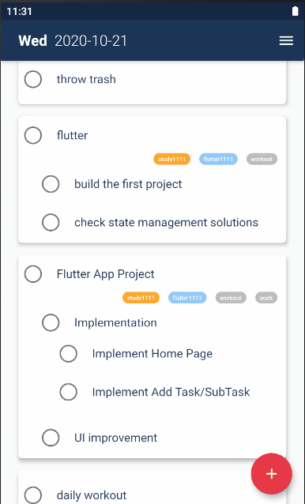
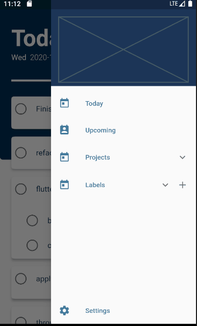
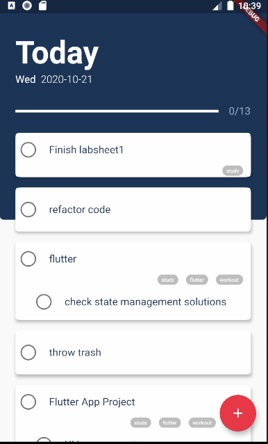

## Taskz

#### Description:
A mobile application for daily tasks management, built with Flutter/Dart, Provider and SQLite

## Project Status
- [x] UI
    + [x] Home page
    + [x] Upcoming page
    + [ ] settings page
    + [ ] projects page
    + [x] Custom date picker
    + [x] Custom FAB animation
- [x] Database schema 
- [x] Add/Delete/Update/Complete task/sub-task
- [x] Add/Delete/Update tag
- [x] Top-level task reordering
- [x] daily task progress tracker 
- [ ] slide to complete sub-tasks
- [ ] reorder sub-tasks
- [ ] bug fixes

#### progress:

This project is almost finished but there're still some instability to be tackled. Currently the user 
can add task and sub-tasks with tags and reorder them. Settings page and projects page are still under development.

## Project Preview
adding new tasks           | adding new tags           | upcoming page
:-------------------------:|:-------------------------:|:-------------------------:|
  |     | 

## Installation and Setup Instructions

Clone down this repository. You will need `flutter` and `dart` installed on your machine.   

Update/Get packages: 
`flutter pub get` 

To run the application:
`flutter run`  

